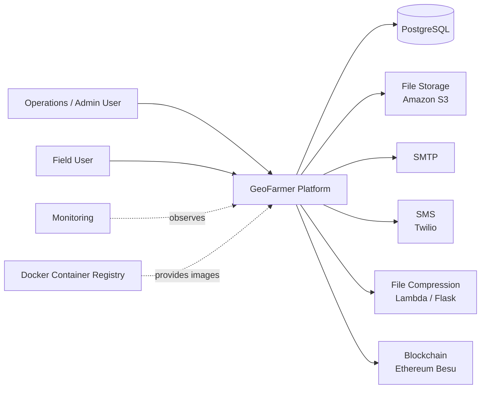

```mermaid
flowchart LR
  Admin[Operations / Admin User]
  Field[Field User]

  Geo[GeoFarmer Platform]

  Postgres[(PostgreSQL)]
  S3[File Storage<br/>Amazon S3]
  SMTP[SMTP]
  Twilio[SMS<br/>Twilio]
  Compress[File Compression<br/>Lambda / Flask]
  Besu[Blockchain<br/>Ethereum Besu]
  Monitoring[Monitoring]
  Registry[Docker Container Registry]

  Admin --> Geo
  Field --> Geo

  Geo --> Postgres
  Geo --> S3
  Geo --> SMTP
  Geo --> Twilio
  Geo --> Compress
  Geo --> Besu

  Monitoring -. observes .-> Geo
  Registry -. provides images .-> Geo
```
