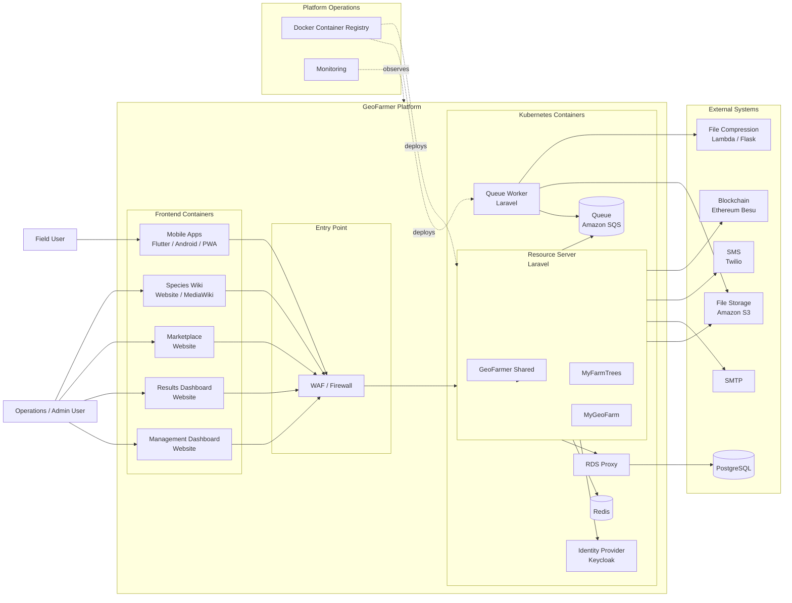

```mermaid
flowchart LR
  Admin[Operations / Admin User]
  Field[Field User]

  subgraph Geo[GeoFarmer Platform]
    subgraph Entry[Entry Point]
      WAF[WAF / Firewall]
    end

    subgraph Frontends[Frontend Containers]
      Mgmt[Management Dashboard<br/>Website]
      Results[Results Dashboard<br/>Website]
      Market[Marketplace<br/>Website]
      Wiki[Species Wiki<br/>Website / MediaWiki]
      MobileApps[Mobile Apps<br/>Flutter / Android / PWA]
    end

    subgraph Backend[Kubernetes Containers]
      subgraph Api[Resource Server<br/>Laravel]
        Shared[GeoFarmer Shared]
        MyGeoFarmSvc[MyGeoFarm]
        TreesSvc[MyFarmTrees]
      end
      Worker[Queue Worker<br/>Laravel]
      Keycloak[Identity Provider<br/>Keycloak]
      Redis[(Redis)]
      Queue[(Queue<br/>Amazon SQS)]
      RdsProxy[RDS Proxy]
    end
  end

  subgraph External[External Systems]
    direction TB
    Postgres[(PostgreSQL)]
    S3[File Storage<br/>Amazon S3]
    SMTP[SMTP]
    Twilio[SMS<br/>Twilio]
    Compress[File Compression<br/>Lambda / Flask]
    Besu[Blockchain<br/>Ethereum Besu]
  end

  subgraph Ops[Platform Operations]
    direction LR
    Registry[Docker Container Registry]
    Monitoring[Monitoring]
  end

  Admin --> Mgmt
  Admin --> Results
  Admin --> Market
  Admin --> Wiki
  Field --> MobileApps

  Mgmt --> WAF
  Results --> WAF
  Market --> WAF
  Wiki --> WAF
  MobileApps --> WAF
  WAF --> Api

  Api --> Shared
  Api --> MyGeoFarmSvc
  Api --> TreesSvc
  Api --> Keycloak
  Api --> Redis
  Api --> RdsProxy
  RdsProxy --> Postgres
  Api --> S3
  Api --> Queue
  Worker --> Queue
  Worker --> S3
  Worker --> Compress
  Api --> SMTP
  Api --> Twilio
  Api --> Besu

  Registry -. deploys .-> Api
  Registry -. deploys .-> Worker
  Monitoring -. observes .-> Geo
```
