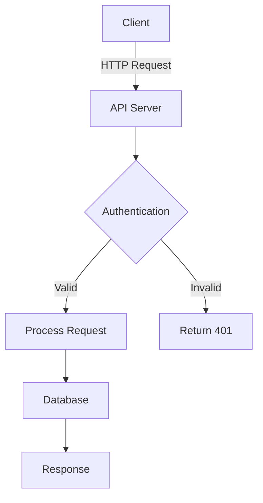

# GeoFarmer Documentation

Technical documentation for the GeoFarmer platform.

## Docusaurus Examples

### Admonitions (Info boxes)

:::note
This is a note admonition.
:::

:::tip
This is a tip for best practices.
:::

:::info
This is information that might be useful.
:::

:::warning
This is a warning about potential issues.
:::

:::danger
This is a danger alert for critical information.
:::

### Code Blocks

```javascript
// JavaScript example
const platform = "GeoFarmer";
console.log(`Welcome to ${platform}`);
```

```php
// PHP example
$platform = 'GeoFarmer';
echo "Welcome to $platform";
```

```bash
# Shell commands
npm install
npm run build
```

### Code Blocks with Line Highlighting

```javascript {2,4-6}
function greet(name) {
  // This line is highlighted
  const message = `Hello, ${name}`;
  // These lines are also highlighted
  console.log(message);
  return message;
}
```

### Mermaid Diagrams



### Tables

| Component  | Technology | Status |
| ---------- | ---------- | ------ |
| API Server | Laravel    | Active |
| Database   | PostgreSQL | Active |
| Queue      | SQS        | Active |

### Links

- Internal link: [Architecture](/docs/architecture)
- External link: [Docusaurus Documentation](https://docusaurus.io)

### Images


### Tabs (requires plugin)

import Tabs from '@theme/Tabs';
import TabItem from '@theme/TabItem';

<Tabs>
  <TabItem value="js" label="JavaScript" default>

```javascript
console.log("Hello from JavaScript");
```

  </TabItem>
  <TabItem value="php" label="PHP">

```php
echo 'Hello from PHP';
```

  </TabItem>
</Tabs>

### Task Lists

- [x] Create documentation structure
- [x] Add Mermaid diagrams
- [ ] Complete API documentation
- [ ] Add deployment guides
