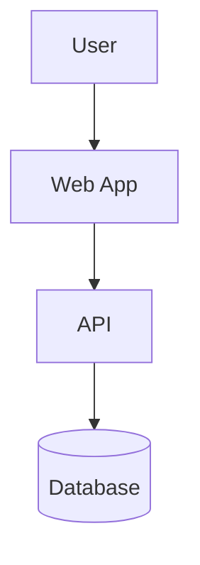
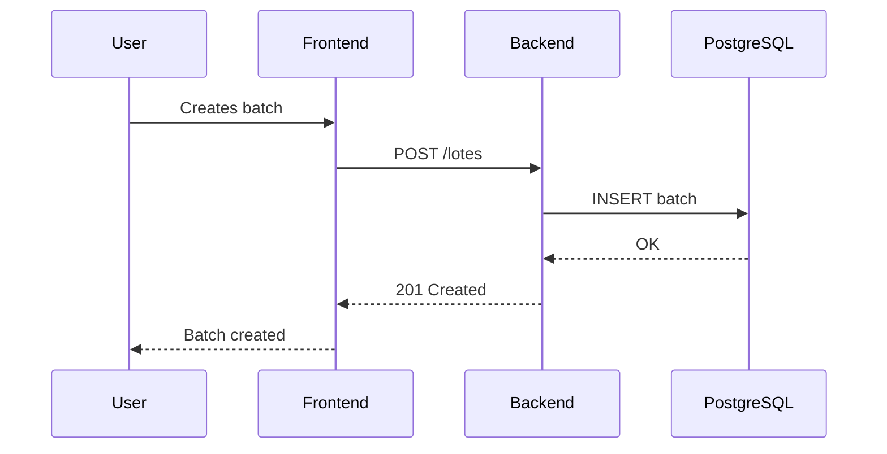
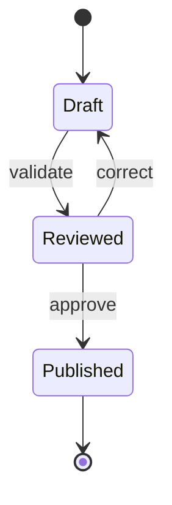

# Mermaid Test

This page is used to verify that Mermaid is working.

## 1) Simple flow

```mermaid
flowchart TD
  U[User] --> W[Web App]
  W --> A[API]
  A --> D[(Database)]
```

## 2) Sequence

```mermaid
sequenceDiagram
  participant U as User
  participant FE as Frontend
  participant BE as Backend
  participant DB as PostgreSQL

  U->>FE: Creates batch
  FE->>BE: POST /lotes
  BE->>DB: INSERT batch
  DB-->>BE: OK
  BE-->>FE: 201 Created
  FE-->>U: Batch created
```

## 3) States

```mermaid
stateDiagram-v2
  [*] --> Draft
  Draft --> Reviewed: validate
  Reviewed --> Published: approve
  Reviewed --> Draft: correct
  Published --> [*]
```
